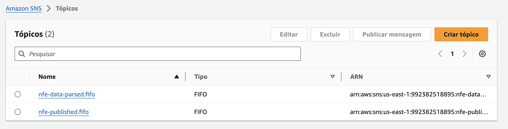
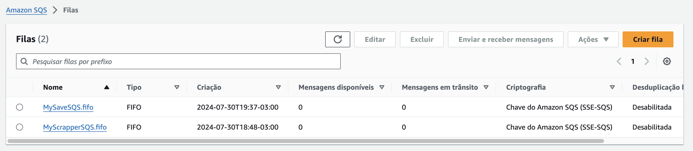
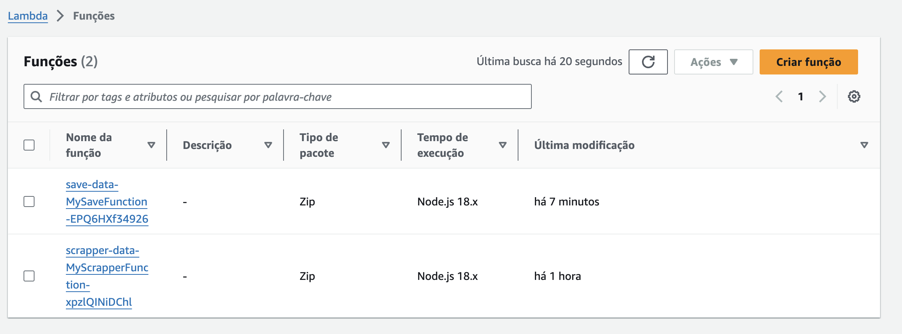

# Midas

Comparador de preços de produtos de supermercados.

## Os repositórios do projeto midas

[SNS Publisher](https://github.com/aninhabort/sns-publisher)

[Scrapper Data](https://github.com/aninhabort/scrapper-data)

[Save Data](https://github.com/aninhabort/save-data)

## Imagens 
Tópicos SNS

Filas SQS

Lamdba Function

