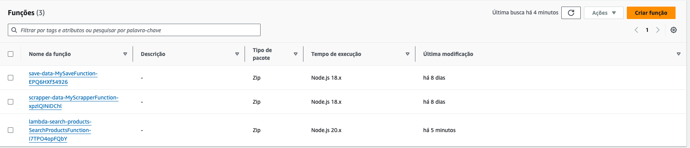

# Midas

Comparador de preços de produtos de supermercados.

## Os repositórios do projeto midas

<a href="https://github.com/aninhabort/sns-publisher">SNS Publisher<a>

<a href="https://github.com/aninhabort/scrapper-data">Scrapper Data<a>

<a href="https://github.com/aninhabort/save-data">Save Data<a>
<a href="https://github.com/aninhabort/lambda-search-products">Search Products</a>

## Imagens 

Tópicos SNS

Filas SQS

Lamdba Function

Render

